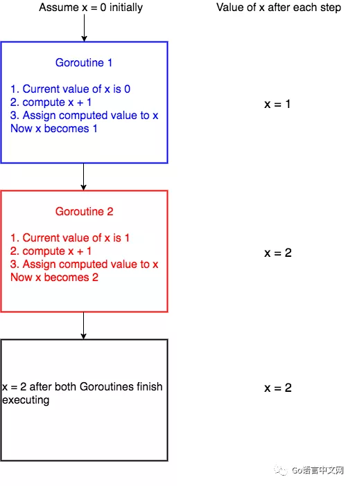

# Go 经典入门 24：Mutex

今天我们学习 `Mutex` 以及怎样通过 `Mutex` 和信道来处理竞态条件（`Race Condition`）。

## 临界区

在学习 `Mutex` 之前，我们需要理解并发编程中临界区（`Critical Section`）的概念。当程序并发地运行时，多个 `Go` 协程不应该同时访问那些修改共享资源的代码。这些修改共享资源的代码称为临界区。例如，假设我们有一段代码，将一个变量 `x` 自增 1。

```go
x = x + 1
```

如果只有一个 `Go` 协程访问上面的代码段，那都没有任何问题。

但当有多个协程并发运行时，代码却会出错，让我们看看究竟是为什么吧。简单起见，假设在一行代码的前面，我们已经运行了两个 `Go` 协程。

在上一行代码的内部，系统执行程序时分为如下几个步骤（这里其实还有很多包括寄存器的技术细节，以及加法的工作原理等，但对于我们的系列教程，只需认为只有三个步骤就好了）：

- 获得 `x` 的当前值

- 计算 `x + 1`

- 将步骤 2 计算得到的值赋值给 `x`

如果只有一个协程执行上面的三个步骤，不会有问题。

我们讨论一下当有两个并发的协程执行该代码时，会发生什么。下图描述了当两个协程并发地访问代码行 `x = x + 1` 时，可能出现的一种情况。


我们假设 `x` 的初始值为 0。而协程 1 获取 `x` 的初始值，并计算 `x + 1`。而在协程 1 将计算值赋值给 `x` 之前，系统上下文切换到了协程 2。于是，协程 2 获取了 `x` 的初始值（依然为 0），并计算 `x + 1`。接着系统上下文又切换回了协程 1。现在，协程 1 将计算值 1 赋值给 `x`，因此 `x` 等于 1。然后，协程 2 继续开始执行，把计算值（依然是 1）复制给了 `x`，因此在所有协程执行完毕之后，`x` 都等于 1。

现在我们考虑另外一种可能发生的情况。



在上面的情形里，协程 1 开始执行，完成了三个步骤后结束，因此 `x` 的值等于 1。接着，开始执行协程 2。目前 `x` 的值等于 1。而当协程 2 执行完毕时，`x` 的值等于 2。

所以，从这两个例子你可以发现，根据上下文切换的不同情形，`x` 的最终值是 1 或者 2。这种不太理想的情况称为竞态条件（`Race Condition`），其程序的输出是由协程的执行顺序决定的。

在上例中，如果在任意时刻只允许一个 `Go` 协程访问临界区，那么就可以避免竞态条件。而使用 `Mutex` 可以达到这个目的。

## Mutex

`Mutex` 用于提供一种加锁机制（`Locking Mechanism`），可确保在某时刻只有一个协程在临界区运行，以防止出现竞态条件。

`Mutex` 可以在 `sync` 包内找到。`Mutex` 定义了两个方法：`Lock` 和 `Unlock`。所有在 `Lock` 和 `Unlock` 之间的代码，都只能由一个 `Go` 协程执行，于是就可以避免竞态条件。

```go
mutex.Lock()
x = x + 1
mutex.Unlock()
```

在上面的代码中，`x = x + 1` 只能由一个 `Go` 协程执行，因此避免了竞态条件。

如果有一个 `Go` 协程已经持有了锁（`Lock`），当其他协程试图获得该锁时，这些协程会被阻塞，直到 `Mutex` 解除锁定为止。

## 含有竞态条件的程序

在本节里，我们会编写一个含有竞态条件的程序，而在接下来一节，我们再修复竞态条件的问题。

```go
package main

import (
    "fmt"
    "sync"
)

var x  = 0

func increment(wg *sync.WaitGroup) {
    x = x + 1
    wg.Done()
}

func main() {
    var w sync.WaitGroup
    for i := 0; i < 1000; i++ {
        w.Add(1)
        go increment(&w)
    }
    w.Wait()
    fmt.Println("final value of x", x)
}
```

在上述程序里，第 7 行的 `increment` 函数把 `x` 的值加 1，并调用 `WaitGroup` 的 `Done()`，通知该函数已结束。

在上述程序的第 15 行，我们生成了 1000 个 `increment` 协程。每个 `Go` 协程并发地运行，由于第 8 行试图增加 `x` 的值，因此多个并发的协程试图访问 `x` 的值，这时就会发生竞态条件。

由于 `playground` 具有确定性，竞态条件不会在 `playground` 发生，请在你的本地运行该程序。请在你的本地机器上多运行几次，可以发现由于竞态条件，每一次输出都不同。我其中遇到的几次输出有 `final value of x 941`、`final value of x 928`、`final value of x 922` 等。

## 使用 Mutex

在前面的程序里，我们创建了 1000 个 `Go` 协程。如果每个协程对 `x` 加 1，最终 `x` 期望的值应该是 1000。在本节，我们会在程序里使用 `Mutex`，修复竞态条件的问题。

```go
package main

import (
    "fmt"
    "sync"
)

var x  = 0

func increment(wg *sync.WaitGroup, m *sync.Mutex) {
    m.Lock()
    x = x + 1
    m.Unlock()
    wg.Done()
}

func main() {
    var w sync.WaitGroup
    var m sync.Mutex
    for i := 0; i < 1000; i++ {
        w.Add(1)
        go increment(&w, &m)
    }
    w.Wait()
    fmt.Println("final value of x", x)
}
```

`Mutex` 是一个结构体类型，我们在第 15 行创建了 `Mutex` 类型的变量 `m`，其值为零值。在上述程序里，我们修改了 `increment` 函数，将增加 `x` 的代码（`x = x + 1`）放置在 `m.Lock()` 和 `m.Unlock()` 之间。现在这段代码不存在竞态条件了，因为任何时刻都只允许一个协程执行这段代码。

于是如果运行该程序，会输出：

```go
// final value of x 1000
```

在第 18 行，传递 `Mutex` 的地址很重要。如果传递的是 `Mutex` 的值，而非地址，那么每个协程都会得到 `Mutex` 的一份拷贝，竞态条件还是会发生。

## 使用信道处理竞态条件

我们还能用信道来处理竞态条件。看看是怎么做的。

```go
package main

import (
    "fmt"
    "sync"
)

var x  = 0

func increment(wg *sync.WaitGroup, ch chan bool) {
    ch <- true
    x = x + 1
    <- ch
    wg.Done()
}

func main() {
    var w sync.WaitGroup
    ch := make(chan bool, 1)
    for i := 0; i < 1000; i++ {
        w.Add(1)
        go increment(&w, ch)
    }
    w.Wait()
    fmt.Println("final value of x", x)
}
```

在上述程序中，我们创建了容量为 1 的缓冲信道，并在第 18 行将它传入 `increment` 协程。该缓冲信道用于保证只有一个协程访问增加 `x` 的临界区。具体的实现方法是在 `x` 增加之前（第 8 行），传入 `true` 给缓冲信道。由于缓冲信道的容量为 1，所以任何其他协程试图写入该信道时，都会发生阻塞，直到 `x` 增加后，信道的值才会被读取（第 10 行）。实际上这就保证了只允许一个协程访问临界区。

该程序也输出：

```go
// final value of x 1000
```

## Mutex vs 信道

通过使用 `Mutex` 和信道，我们已经解决了竞态条件的问题。那么我们该选择使用哪一个？答案取决于你想要解决的问题。如果你想要解决的问题更适用于 `Mutex`，那么就用 `Mutex`。如果需要使用 `Mutex`，无须犹豫。而如果该问题更适用于信道，那就使用信道。:)

由于信道是 `Go` 语言很酷的特性，大多数 `Go` 新手处理每个并发问题时，使用的都是信道。这是不对的。`Go` 给了你选择 `Mutex` 和信道的余地，选择其中之一都可以是正确的。

总体说来，当 `Go` 协程需要与其他协程通信时，可以使用信道。而当只允许一个协程访问临界区时，可以使用 `Mutex`。

就我们上面解决的问题而言，我更倾向于使用 `Mutex`，因为该问题并不需要协程间的通信。所以 `Mutex` 是很自然的选择。

我的建议是去选择针对问题的工具，而别让问题去将就工具。:)
